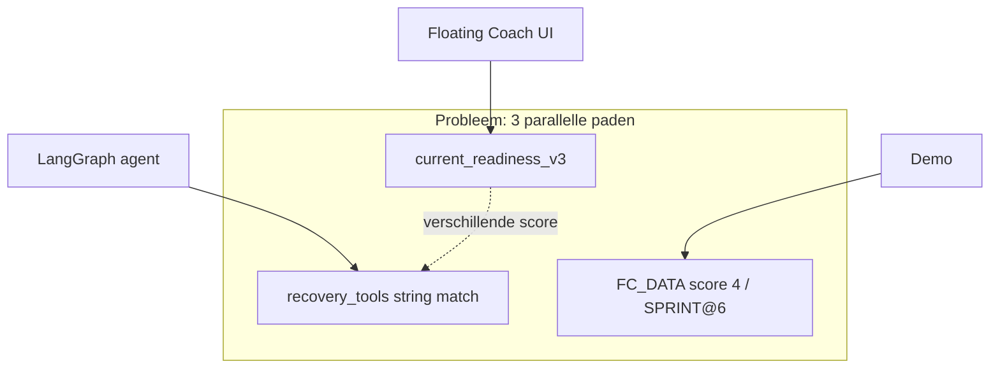

# Plan: algoritme-nauwkeurigheid & consistentie

**Doel:** één betrouwbare keten van Garmin-data → herstelscore → training → belasting → coach, zonder tegenstrijdige paden (Telegram-legacy, demo-mismatch, dubbele formules).

**Scope:** `app/api/garmin.py`, `app/tools/training_recommendation_engine.py`, `app/tools/recovery_tools.py`, `app/api/web.py`, `app/agents/conversational_agent.py`, `Floating Coach/src/*`, tests.

**Niet in scope (fase 3+):** volledige TRIMP/TSS-pariteit met TrainingPeaks, ML-modellen, multi-user A/B.

---

## Huidige problemen (samenvatting)



| P0 | Omschrijving |
|----|----------------|
| 1 | Drie herstel-systemen (v3 / legacy / demo) |
| 2 | HRV vs vast 45 ms; HR fatigue vs absolute 130–160 bpm |
| 3 | `sport_max_hr` = max observed → zone-bias |
| 4 | Load ratio: backend 28d vs frontend 23d + andere drempels |
| 5 | Demo SPRINT@6 vs live VO2MAX@5–6 |
| 6 | Weer alleen tekst; geen plan-aanpassing |
| 7 | Score 0 vóór fetch; dubbele caps client/server |

---

## Fase 0 — Fundament (1–2 dagen)

### 0.1 Canonical module

**Nieuw bestand:** `app/core/readiness.py` (of `app/services/readiness/`)

Verplaats en exporteer:
- `_recovery_score` → `compute_readiness_score(inputs) -> ReadinessResult`
- `_recent_training_fatigue` → `compute_recent_fatigue(activities, hr_profile) -> FatigueResult`
- `_type_from_recovery` (uit engine) → `workout_type_from_readiness(score, metrics, patterns)`

**API-contract** (`ReadinessResult`):
```python
{
  "score": int | null,           # null = onbekend, NIET 0
  "score_status": "ready" | "loading" | "insufficient_data",
  "components": { ... },        # ruwe termen vóór round
  "caps_applied": [...],
  "penalty": float,
  "version": "readiness_v4"
}
```

Alle consumers (`get_recovery_snapshot`, tests, agent) importeren **alleen** deze module.

### 0.2 Legacy agent opschonen

| Actie | Bestand |
|-------|---------|
| `assess_recovery_status` laat intern `GET`-logica aanroepen via shared `compute_readiness_score` | `recovery_tools.py` |
| Of: tool vervangen door dunne wrapper die JSON van v3 teruggeeft | `conversational_agent.py` |
| Prompt: "Gebruik NOOIT eigen herstel-heuristiek; score uit context is leidend" | `web.py` + agent system prompt |

**Acceptatie:** zelfde `user_id` → legacy tool en `/garmin/recovery` → zelfde `score` (±0 als tool alleen v3 leest).

### 0.3 UI score-states

| Was | Wordt |
|-----|--------|
| `session.userId` → default score `0` | `null` + `score_status: 'loading'` |
| Ring toont `0/6` | Skeleton of "—" tot eerste fetch |
| `currentReadinessScore()` dubbele caps | **Verwijderen**; alleen server score tonen (breakdown mag caps tonen ter info) |

**Bestanden:** `Floating Coach/src/app.jsx`, `recovery.jsx`, `dashboard.jsx`, `api.js` types.

---

## Fase 1 — Personalisatie HR & HRV (3–5 dagen)

### 1.1 HR-profiel per gebruiker/sport

**Nieuw:** `app/core/hr_profile.py`

```python
def resolve_hr_profile(user_id, sport, activities, dailies) -> HRProfile:
    # Prioriteit:
    # 1. Garmin user max / resting uit health (indien veld beschikbaar)
    # 2. Percentiel 95–99 van max_hr laatste 90d per sport (winsorize >210)
    # 3. Leeftijd-formule (220-age) als fallback met lage confidence
```

**Gebruik in:**
- `_recent_training_fatigue`: `intensity` van `%HR_reserve` of `%HR_max` i.p.v. `avg_hr >= 160`
- `_classify_effort` / `_classify_segment_effort`: zelfde `sport_max_hr` uit `HRProfile.effective_max`
- `build_personal_training_profile`: zones als % van `effective_max`, niet ruwe max activity

**Drempel-mapping (voorstel):**
| Zone | % max HR |
|------|----------|
| easy | < 70% |
| endurance | 70–80% |
| threshold | 80–90% |
| vo2 | ≥ 90% |

**Fatigue intensity (voorstel):**
```
ratio = avg_hr / effective_max
intensity = 1.0 + f(ratio)  # piecewise: +0.1 @0.65, +0.25 @0.75, +0.45 @0.85
hard_session: ratio >= 0.78 OR max_hr >= 0.92 * effective_max
```

### 1.2 HRV baseline

**Data:** `hrv.lastNightAvg` + historie 14–28 nachten uit DB.

```python
baseline = median(last_14_valid_nights)
deviation = (last_night - baseline) / max(baseline * 0.15, 8)  # ms
score += clamp(deviation * 0.4, -1.0, +1.0)  # vervang (hrv-45)/35
```

**Stale/missing:** geen HRV-term; flag `hrv_insufficient` in response.

**Frontend:** breakdown toont "vs jouw baseline 52 ms (+8%)" i.p.v. vaste 45.

### 1.3 Body Battery & stress

| Item | Actie |
|------|--------|
| BB stale (>6h) | Blijft excluded; cap `penalty>=0.4 → max 3` alleen als **geen** sleep_score én geen hrv_deviation |
| Stress | Optioneel: nachtvenster (slaap start–end) i.p.v. hele dag — fase 1b |

**Versie bump:** `readiness_v4` in API + cache keys `recovery_v4_${userId}`.

---

## Fase 2 — Belasting & training consistentie (2–3 dagen)

### 2.1 Unified load ratio

**Nieuw:** `app/core/load_metrics.py`

```python
def compute_load_ratio(activities, *, acute_days=7, chronic_days=28) -> LoadMetrics:
    acute = sum_duration(last 7d)
    chronic_weekly = sum_duration(days 8..35) / 4  # align met huidige backend
    ratio = acute / chronic_weekly if chronic_weekly > 0 else None
```

| Consumer | Wijziging |
|----------|-----------|
| `weekly_analysis()` | import helper |
| `build_sport_baselines()` | zelfde helper per sport |
| `activities.jsx` TrendCard | verwijder `(23/7)` client formule; gebruik API `sport_baselines[].load_ratio` of `/garmin/analysis/weekly` |

**Drempels overal:** `< 0.75` laag, `0.75–1.25` balanced, `> 1.25` hoog (documenteer in UI).

### 2.2 Demo / live parity trainingstype

**Beslissing (kies één):**

- **Optie A (aanbevolen):** Live backend krijgt SPRINT bij score 6 + `recentTrainingPenalty < 0.4` + pattern heeft sprint-type in laatste 30d.
- **Optie B:** Demo score 6 → VO2MAX (demo volgt live).

Implementeer in `_type_from_recovery` + `FC_DATA.recommendedByRecovery` + `workout-plan.js` `buildDraft`.

### 2.3 Sportkeuze

`_choose_sport`: volgorde = `pattern.preferred_sport` → meest frequente sport laatste 14d → `RUNNING`.

---

## Fase 3 — Weer & gewogen load (2 dagen)

### 3.1 Weer in engine

In `build_recommendation()` na duur/intensiteit:

| Conditie | Actie |
|----------|--------|
| feels_like ≥ 28°C | `durationMin *= 0.9`, `intensityPct = min(intensityPct, 95)` |
| feels_like ≤ 3°C | `durationMin += 8` (WU), cap intensity 100% |
| wind ≥ 28 km/h | outdoor run/cycle → note + optioneel swap naar indoor profile |
| onweer | `type = HERSTEL` of flag `outdoor_blocked` |

Reden opnemen in `reasoning[]` (bestaand patroon).

### 3.2 TRIMP-light (optioneel)

```python
trimp = duration_min * hr_reserve_ratio * sport_factor
acute_trimp = sum(7d); chronic = sum(28d)/4
load_ratio_intensity = acute_trimp / chronic
```

Expose naast duration ratio; UI toont duration als primair, TRIMP als secundair label "intensiteit-gewogen".

---

## Fase 4 — Tests, docs, rollout (2 dagen)

### 4.1 Unit tests

**Nieuw:** `tests/test_readiness_v4.py`

| Case | Verwacht |
|------|----------|
| Goede slaap + lage stress + BB 80 | score ≥ 4 |
| HRV -20% vs baseline | score −1 vs baseline run |
| Harde run 50min @ 85% max gisteren | penalty ≥ 0.8 |
| BB stale + penalty 0.5 | cap ≤ 3 |
| Atleet 55j, avg_hr 145 | zelfde penalty als 25j @ 145 (via %max) |

**Nieuw:** `tests/test_load_metrics.py` — acute/chronic windows.

### 4.2 Documentatie

**Nieuw:** `docs/ALGORITHMS.md` — formules, versies, breaking changes.

### 4.3 Migratie & deploy

1. Feature flag `READINESS_VERSION=v4` in config (default v3, flip na tests).
2. Frontend: cache invalidation `fc_live_recovery_*`.
3. Coolify: alleen `app` rebuild; geen nginx wijziging.
4. Monitor: log `score_inputs` + `caps_applied` sample 1% requests.

---

## Implementatievolgorde (todos)

| # | ID | Geschat | Blokkeert |
|---|-----|---------|-----------|
| 1 | `p0-single-recovery` | 1d | alles |
| 2 | `p0-hr-baseline` | 2d | fatigue + profile |
| 3 | `p0-hrv-baseline` | 1d | recovery v4 |
| 4 | `p1-ui-score-states` | 0.5d | UX na v4 API |
| 5 | `p1-load-ratio` | 1d | activities card |
| 6 | `p1-demo-live-parity` | 0.5d | — |
| 7 | `p2-weather-engine` | 1d | — |
| 8 | `p2-weighted-load` | 2d | optioneel |
| 9 | `p2-tests-docs` | 2d | release |

**Totaal:** ~10–12 werkdagen sequentieel; 1–2 devs parallel mogelijk na fase 0.

---

## Risico's & mitigatie

| Risico | Mitigatie |
|--------|-----------|
| Scores verschuiven → gebruikers verrast | Changelog in app + "nieuw algoritme" banner 1 week |
| Weinig HRV-historie | Graceful fallback; toon confidence |
| Agent nog legacy | Feature flag + integration test op `/web/chat` |
| Breaking API | `version` field; frontend backward compatible 1 release |

---

## Acceptatiecriteria (definition of done)

- [ ] Eén `readiness_v4` score voor UI, API, en agent tool
- [ ] Geen score `0` tijdens loading; `null` + status
- [ ] Fatigue gebruikt `%HR_max`; geen harde 160 bpm
- [ ] HRV t.o.v. persoonlijke baseline in score + breakdown
- [ ] Load ratio identiek backend vs Activiteiten-trend (±0.01)
- [ ] Demo en live:zelfde type-mapping regels gedocumenteerd
- [ ] Weer ≥28°C verlaagt duration of intensity meetbaar in `build_recommendation` response
- [ ] ≥15 unit tests groen op CI

---

## Buiten scope (bewust later)

- Garmin Training Load / Recovery Time API integratie
- LTHR-test workflow in UI
- Chat structured cards / auto-upload Garmin
- Volledige deprecatie `webapp/` Next.js
